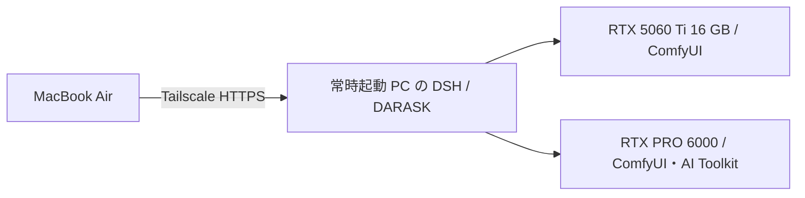

# dsh-darask

DeepSeek Harness の「設定 → アカウント」に、OpenAI API・OpenRouter・Grok Build・Cursor・Codex・Claude Code・ローカルモデルの接続状態と優先順位をまとめる日本語プラグインです。使用量・残量は左サイドバーの設定の上にある「Usage」で確認できます。DSH 標準の UI 部品とテーマを使用します。Tailscale、Kitesurf、Cloudflare Browser Run、修正版 Bridge Gateway と、PC を選んで作成するワークスペース、二台の PC を使う「GPU ジョブ」画面も組み込みます。「設定 → プラグイン」では Hermes / oh-my-deepseek-harness 由来の機能をカテゴリ別に有効化します（初期状態はすべてオン）。

DSH 本体の日本語パックに加え、Grok・Codex Connect の設定と認証メッセージ、Gateway の日本語 UI を提供します。サービス名、モデル ID、コード、外部サービス自身のページ、外部 CLI の原文出力はそのまま表示します。表示言語は DSH の「設定 → 一般」で日本語を選択してください。

対象は **DSH 0.1.5-rc.2 / Node.js 24.19.0 以上**。更新版 `0.1.0-alpha.8` は、Grok Build / Cursor 相当の作業を DSH 本体のファイル・シェルツールで行い、Windows では PC 画面のスクリーンショットとマウス・キーボード操作も使えます。`0.1.0-alpha.7` までの機能範囲は次のとおりです。

| サービス | ログイン | 使用量・残量 | DSH からの利用 |
|---|---|---|---|
| OpenAI API | API キー。管理キーは利用状況用 | データ共有インセンティブの日次無料トークン。残量%は usage tier 指定時のみ | 通常の会話。既定は司令塔 `gpt-5.6-sol`、作業は Fusion で `gpt-5.6-luna` |
| OpenRouter | OAuth PKCE / API キー | API キーの使用額・上限残額。管理キーがあればアカウント残高 | 通常の会話モデル |
| Grok Build | `dsh-grok-provider` の既存認証 | 既存プラグインが取得できる利用枠 | 通常の会話モデル / CLI への委任 |
| Cursor | 公式 Cursor Agent CLI | 個人アカウントの残量は取得不可と表示 | CLI への委任 |
| Codex | ChatGPT OAuth・最大16アカウント | アカウント別の利用枠・クレジット | 使用中アカウントで通常の会話モデル |
| Claude Code | 公式 Claude Code CLI（Claude Pro/Max） | 任意の `statusLine` 連携による 5 時間・7 日の利用枠 | 通常の会話モデル / CLI への委任 |
| ローカルモデル | llama.cpp / Tailscale 内の互換 API | API が返す処理トークン数。契約残量・クレジットは対象外 | 通常の会話モデル |
| Jev | Vercel AI Gateway API キー | 未表示 | `darask_jev_evaluate` による分類・採点・検証 |

取得できない値を 0 として扱いません。通貨・単位・アカウントが異なる残高は合算しません。Codex の認証先は Codex Connect であり、別の Codex CLI 認証ストアへ資格情報をコピーしません。OpenAI API の無料トークンはデータ共有への同意が条件です。入出力が学習に使われるため、顧客データや機密では共有をオンにしないでください。

## インストール

`0.1.0-alpha.7` では Tailscale / Cloudflare の HTTPS 接続で Codex ログインが拒否される問題を修正しました。DSH の認証済み Connection と同一接続元チェックを通す専用 API を使用します。認証ガードや接続元制限は無効化しません。

「設定 → アカウント → AI サービス → Codex」の「アカウントを追加」から複数の ChatGPT アカウントを保存できます。「使用する」は以後のリクエストに反映されます。使用量の取得でアカウントを切り替えず、各アカウントに紐づけて取得・更新します。Usage には残量・クレジットを別々に表示し、取得失敗は残量ゼロと扱いません。各取得結果は約1分間キャッシュします。削除前に確認し、使用中アカウントが複数ある場合は先に別のアカウントへ切り替えます。

Mac など別 PC のブラウザーで認証した場合は、ログイン後の localhost ページが開けなければ、そのアドレス全体を同じカード内の「Mac など別の PC でログインする場合」に貼り付けます。戻り先 URL は上流の OAuth 検証に渡し、ログに記録しません。追加ログインの中止では既存のアカウントを削除しません。

`0.1.0-alpha.6` では、起動時に結合された JavaScript の互換処理が別プラグインの登録まで削除する不具合を修正しました。変更を対象のプラグイン内に限定し、57 個すべての起動時登録と対象外コードの保持を回帰テストで確認しています。

`0.1.0-alpha.5` では「アカウント」を **AI サービス / PC・Tailscale / ブラウザー** に整理しました。「ワークスペース」「GPU ジョブ」「開発・更新」は設定の独立項目です。Gateway の補助機能は「プラグイン → 追加の接続」に折りたたみ、従来の重複したワークスペース選択やモバイル画面の上書きを除去しています。DARASK 本体の「設定 → プラグイン」は別画面で、Hermes 由来の機能を DeepSeek / 安全 / 運用 / メディア / メッセージに分けます。メディアの Cloudflare R2 を設定すると、生成した画像・動画は `darask/media/` へ自動アップロードされ、別環境から `darask_r2` で取得して編集できます。

このリポジトリは非公開で管理しています。ソースの取得と GitHub リリースのダウンロードには、アクセス権のある GitHub アカウントでの認証が必要です。認証情報を URL やスクリプトへ直接書かず、Git の認証管理を使用してください。npm レジストリには未公開です。

Node.js と npm、対象バージョンの DSH が必要です。CLI 委任を使うサービスの公式 CLI も別途インストールしてください。

ソースから配布パッケージを作る場合:

```powershell
git clone https://github.com/daraskme/dsh-darask.git
cd dsh-darask
npm ci
npm run check
npm pack
```

DSH の作業ディレクトリで、作成した `.tgz` を指定します。

```powershell
npm install @deepseek-ai/dsh@0.1.5-rc.2
npx dsh plugin --profile web add "C:\path\to\dsh-darask-0.1.0-alpha.8.tgz"
npx dsh --profile web
```

ソースから DSH ごと起動する場合は、プラグイン追加後に同じ `DSH_HOME` を指定して `npm start` を使えます。`scripts/start.mjs` は DSH を `127.0.0.1:3080` で起動し、本機の Tailscale DNS 名とポート `8443` を接続許可に加えます。表示された認証 URL で DSH を開きます。CLI を通常起動した場合は、Tailscale からの接続用に同じ `--trusted-host` の指定が必要です。

既に旧プラグインを個別登録している場合は、先に下記の移行を行います。旧バンドルと DARASK を同時に有効にすると、同じプロバイダーや UI が二重登録されるためです。

DARASK は `@fang2hou/dsh-locale-ja@0.5.0`、`dsh-grok-provider@1.0.5`、`dsh-codex-connect@0.1.0-alpha.4.35`、`dsh-bridge-gateway@0.1.7` をまとめて構成します。Gateway は [daraskme/dsh-bridge-gateway の固定コミット](https://github.com/daraskme/dsh-bridge-gateway/tree/9c53f3982ffd1337a59ba240b8f4dadd2b726178) に、下記の接続修正を加えて同梱しています。npm 版 Gateway は参照しません。`dsh-bridge` の別登録と `dsh-cursor-acp` は必要ありません。

## 初期設定と優先順位

1. 「設定 → アカウント」で各サービスにログインします。モデル・実行ファイルは「接続・モデル設定」にあります。
2. 通常の会話に使う OpenRouter・Grok・Codex・Claude・ローカルモデルのモデル ID を入力します。Claude の契約ログイン後、セッション右下のモデル選択に Anthropic のモデルが出ます。使用可能なモデルは各プロバイダー側で確認してください。
3. 必要なサービスを有効にし、↑↓で順番を決めます。「用途別のモデル」では検索・調査などの用途ごとに優先する会話モデルを選べます。未設定・利用不能の場合は通常の優先順位へ戻ります。
4. Jev を使う場合は、同じ画面で Vercel AI Gateway API キーを保存します。Jev は通常会話には使わず、`darask_jev_evaluate` から `typesafe-ai/jev` を呼び出します。
5. 保存後に「優先順位で自動選択」を有効にします。初期状態ではオフです。

会話の権限セレクターに、Claude の「自動」／Codex の「承認」（危険な操作だけ確認）に相当する **自動** を追加します。並びは閲覧のみ → ワークスペース内書き込み → 自動 → 完全な権限です。ワークスペース内の読み書き、ビルド、テスト、通常のシェル、git の取得・切替、ブラウザーの閲覧・クリック・入力は確認せず、破壊的なコマンド、公開・外部送信、システム変更、PC 画面操作だけ承認を求めます。既定は従来どおり「ワークスペース内書き込み」です。完全な権限は確認しません。

通常の会話では、設定されたモデルの経路をリクエスト前に選択します。認証・利用枠が確認できない経路を、取得不能という理由だけで枯渇扱いにはしません。実際の認証は各プロバイダーが確認します。リクエスト開始後にエラーが出た処理を、別サービスへ自動再送する機能はありません。

Grok と Codex の認証・利用枠は、それぞれの既存プラグインの API から画面が取得します。この二つの値は現在、サーバー側の自動選択判定へ渡していません。したがって残量表示はできますが、残量による Grok/Codex の自動スキップは初期版の対象外です。

Cursor は通常の会話モデルの自動選択には入りません。Claude の契約ログインは会話モデルとしても使えます。`darask_agent` ツールが `auto` を指定された場合、同じ保存済み順位から Cursor・Grok・Claude の利用可能な CLI を選びます。初期版は読み取り・調査・計画用です。Cursor は `ask`、Grok と Claude は `plan` モードを使用します。`force` / `yolo` は指定しません。

Grok と Cursor は、絶対パス、起動引数、環境変数をサービスごとに分離します。同一ワークスペースの DARASK CLI 実行は一度に一件です。CLI が終了したことを確認できない場合は、そのワークスペースのロックを維持します。

Windows の既定候補:

| サービス | 実行ファイル |
|---|---|
| Grok Build | `C:\Users\<ユーザー>\.grok\bin\agent.exe` |
| Cursor Agent | `C:\Users\<ユーザー>\AppData\Local\cursor-agent\agent.cmd` |

曖昧な `agent` という名前だけでは起動しません。`.cmd` は対応するランチャーから実体を特定できる場合に利用できます。未対応のランチャーでは、画面から直接の `.exe` または CLI の `.js` を指定してください。公式 ACP 部品が入っていない Web ビルドでも、この委任機能は ACP に依存しません。

## Claude の使用量を表示する

Claude Code の `statusLine` へ同梱ヘルパーを設定すると、最新の利用枠だけを `DSH_HOME/darask/claude-usage.json` に保存します。既存の `statusLine` がある場合は、その処理と組み合わせてください。プラグインは Claude の設定を自動変更しません。

```json
{
  "statusLine": {
    "type": "command",
    "command": "node \"C:/path/to/dsh-darask/scripts/claude-statusline.mjs\""
  }
}
```

Claude と DSH を同じ `DSH_HOME` で起動します。DSH の保存先を変更している場合は、ヘルパーの `DARASK_DATA_DIR` をその `darask` ディレクトリに合わせます。保存するのは利用率とリセット時刻だけです。Claude が値を返さない契約・セッションでは取得不可になり、古い値には前回取得値の表示が付きます。[Claude 公式 statusLine ドキュメント](https://code.claude.com/docs/en/statusline)には、対象の利用枠・契約・バージョン条件が記載されています。

## Git のソースを編集し、DSH 内から更新する

編集用のワークスペースは、`src/` と `package.json` のある **dsh-darask の Git リポジトリのルート**です。DSH のデータ用フォルダーやインストール先の `node_modules` を編集用に選ばないでください。

エージェントがこのリポジトリを編集するときは、スキル `dsh-dev` を読み込みます。プラグインが起動時に登録します。`grep` は gitignore を尊重するため、`node_modules` や存在しない `*.ts` の絞り込みでは「No files were searched」になります。検索対象は `src` / `scripts` / `test` / `vendor` です。

Git で取得したソースへ移動し、依存パッケージを導入後、起動中の DSH を終了して実行します。

```powershell
npm run dev
# 導入先を変えた場合:
npm run dev -- --dsh-root "D:\Apps\DSH"
```

公式の `dsh plugin add link:...` で Web プロファイルを Git のソースへ接続し、変更前のプロファイル設定を DSH データ内へバックアップします。`src` のサーバー処理は公式 HMR で読み直し、画面は保存時に自動ビルドします。通常はブラウザーの再読み込みだけで反映できます。構文エラーでビルドできない場合は直前の画面バンドルを維持します。

**設定 → 開発・更新** では、編集フォルダーのワークスペース登録、Git のブランチ・変更ファイル・差分の表示、編集の再ビルド、GitHub の更新確認と適用ができます。更新先はこのリポジトリの `origin/main` です。未コミットの変更がある場合や履歴が分岐した場合は停止し、fast-forward のみ行います。更新確認には Git の認証管理に保存された GitHub 認証を使用します。

コミット・push はワークスペースで内容を確認して行ってください。自動コミット・自動 push、変更の破棄、強制リセットは行いません。GitHub からの適用は DSH の再起動を伴うため、実行中のタスクを終了してから操作してください。依存パッケージに変更がある場合は npm で再導入します。起動スクリプト自身の編集は開発モード全体の再起動が必要です。起動に失敗した場合は `DSH_HOME/darask/dsh.err.log` と Git 差分を確認してください。

インストーラーが作成する `start-dsh.mjs` は開発モードの登録を引き継ぎます。ソースフォルダーを移動した場合は、新しい場所から `npm run dev` で登録し直してください。配布パッケージだけを入れた PC では、Git のソースから開発モードを起動するまでこの更新機能は無効です。

### ハブから登録済み PC へ更新を配布する

**設定 → 開発・更新 → 登録済みの PC に配布** で、ハブに登録した接続先へ更新を依頼できます。「GitHub から更新」が成功すると、再起動後に自動で配布します。インストーラーで導入したハブも、次回起動時に導入パッケージの変更を検出して配布します。初回起動は現在の版を記録し、以後の変更が自動配布の対象です。手動の「この PC から配布」は初回から使えます。

- **開発モードの接続先**: 接続先自身の `origin/main` を fast-forward し、ビルド・再起動します。未コミットの変更、分岐した履歴、他の開発操作の実行中は更新しません。
- **インストーラーで導入した接続先**: ハブの tar.gz を受信して一時配置し、DSH の終了とポート 3080 の解放を待ってから `scripts/setup-dsh-host.mjs` で再導入・起動します。`app` / `data` / `packages` の標準構成が必要です。データや認証は既存のものを引き継ぎます。
- 開発モードのハブは現在のソースをビルドして `npm pack` します。配布版のハブは導入時のアーカイブをそのまま使います。同一アーカイブはスキップし、バージョン文字列が同じでも内容が変わっていれば配布します。接続先は受けた更新を別の PC へ再配布しません。

初回は各 PC にこの機能を含む版を導入し、**PC・Tailscale** に登録して接続確認してください。ハブからの通信は保存済みの DSH 認証 Cookie を使用し、Origin と接続先ホスト ID を検証します。Cloudflare Access の対話ログインが必要な公開 URL は自動配布には使わず、既存の LAN / Tailscale 接続 URL を登録してください。

配布は接続先の DSH を再起動するため、実行中の作業を保存してからハブを更新してください。アーカイブは圧縮後 64 MiB、展開後 256 MiB までです。切断中・旧版・認証切れの PC は一覧に失敗として残り、他の PC への配布は続きます。復旧後に「この PC から配布」で再試行できます。「更新依頼が完了」は受信側で更新開始を受け付けた状態です。再起動後に接続を確認し、失敗時は接続先の `data/darask/update/update.log` を確認してください。

### Cloudflare Zero Trust Access で公開 URL にログインする

`https://dsh.darask.me/` 用の Access アプリケーションを Cloudflare 側で設定し、同じアプリケーションの情報を dsh-bridge に登録します。アプリケーションの作成や許可ユーザーの設定は自動では行いません。

1. [Cloudflare Zero Trust](https://one.dash.cloudflare.com/) の **Access controls → Applications → Add an application → Self-hosted** で、公開ホスト名に `dsh.darask.me` を指定します。パスは空欄にし、API と WebSocket を含むホスト全体を保護します。
2. Allow ポリシーに利用を許可するメールアドレスや ID プロバイダーのグループを設定します。Google などのログイン方法、またはメールのワンタイム PIN を選びます。アプリケーションを保存し、プライベートウィンドウで公開 URL にアクセスして Access のログインが表示されることを確認します。
3. チームドメイン（`<team>.cloudflareaccess.com`）と、アプリケーションの **Additional settings → Application Audience (AUD) Tag** を控えます。[JWT 検証の公式手順](https://developers.cloudflare.com/cloudflare-one/access-controls/applications/http-apps/authorization-cookie/validating-json/)も参照してください。
4. ローカルまたは LAN の管理接続から dsh-bridge の認証設定を開き、保護を有効にしたまま **Cloudflare Zero Trust Access** にチームドメインと AUD を保存して有効にします。Cloudflare Tunnel の転送先はループバック上の **dsh-bridge ゲートウェイ**（通常 `http://127.0.0.1:3082`）にします。
5. 公開 URL を開き直します。Access でのログイン後、ゲートウェイは `Cf-Access-Jwt-Assertion`（または `CF_Authorization` Cookie）の署名・発行元・AUD・有効期限を検証し、dsh-bridge のパスワード画面を挟まずに通します。DSH 自体の認証と管理操作の制限は引き続き適用されます。

署名鍵はチームの公開 JWKS から取得し、最大 1 時間キャッシュします。鍵のローテーション時は再取得します。JWT がない・不正・期限切れ、または鍵を取得できない場合は 401 を返し、ゲートウェイのパスワードログインにはフォールバックしません。Access アプリケーションを設定していない場合、ゲートウェイ単体では Cloudflare のログイン画面へ転送できません。

この検証は、ループバックから届く Cloudflare ヘッダー付きのトンネル通信に適用します。直接のローカル接続、LAN、独自トンネルの認証方式は従来どおりです。別ホストのリバースプロキシから dsh-bridge へ接続する構成は対象外です。Access が保護するホストを通さずにゲートウェイへ到達する経路にも、既存の DSH / ゲートウェイ認証を維持してください。

## Tailscale で PC を接続する

「設定 → アカウント → PC・Tailscale」の **この PC の QR を表示** から、認証付きの Tailscale HTTPS 接続 QR を表示・保存できます。相手 PC の QR を **QR で PC を追加** からカメラ・画像で読み取り、「接続を確認して保存」で登録します。URL を貼り付ける方法もあります。QR の生成・読み取りは本機内で行い、Cloudflare へ送信しません。

QR は DSH のログイン情報を含む本人用です。DSH の再起動後は新しい QR を使います。カメラを閉じると撮影を停止します。QR のリンク先は Tailscale の HTTPS に限定し、読み取りだけでは移動・接続登録を実行しません。Mac から操作するだけなら Mac に DSH を導入する必要はありません。

Tailscale アプリで本機を接続すると、DARASK の「設定 → アカウント → PC・Tailscale」に本機の接続状態・DNS 名・IP を表示します。「Tailscale 内で DSH を共有」で HTTPS `8443` から DSH `3080` へ転送します。初期状態は共有停止です。

公開インターネット向けの Funnel は有効にしません。同じポートに他の設定がある場合は変更せず、DARASK が作成した共有だけを停止できます。DSH の認証は引き続き必要です。起動時に Tailscale が未接続だった場合や DNS 名が変わった場合は、接続後に起動ヘルパーから DSH を再起動してください。[Tailscale Serve の仕様](https://tailscale.com/docs/reference/tailscale-cli/serve)。

## PC 画面を見て操作する

Grok Build や Cursor と同様に、DSH 本体の `read` / `write` / `edit` / `grep` / `glob` / `pwsh` でこのワークスペースを編集できます。加えて Windows では、会話から **この PC の画面を見てマウスとキーボードで操作**できます。

1. 「設定 → アカウント → PC・Tailscale」の **PC 画面の操作** で有効にします。初期状態はオフです。
2. 会話で画面の確認や GUI 操作を指示します。ツール名は `darask_computer` です。
3. 先にスクリーンショットを撮り、その画像上の座標でクリックします。クリック・入力のあとに新しい画面が返るので、それを見て次の操作を決めます。

公開ウェブページは Kitesurf、この PC のアプリやデスクトップは `darask_computer` を使います。ロック画面・UAC・未知のパスワード欄には使いません。スクリーンショットは `DSH_HOME/darask/computer` に保存し、モデルへは DSH の添付として渡します。現状の対象は Windows の対話セッションです。

## ローカルの会話モデル

「設定 → アカウント → AI サービス → ローカルモデル」で、`llama-server` の絶対パス、GGUF ファイル、モデル ID、コンテキスト長、GPU に載せるレイヤー数を保存します。「起動」で本機の `127.0.0.1:18081` に起動し、準備ができたモデルを通常の会話から選べます。停止できるのは DARASK が起動したプロセスです。既に起動している互換 API へ接続する場合は、そのサーバーのモデル ID を指定します。

別 PC の推論サーバーには `https://<端末>.<Tailnet>.ts.net:<ポート>/v1` を指定できます。認証キーは専用の資格情報に保存します。この画面の推論接続先は一つで、リモートサーバーの起動・停止は対象外です。ローカルモデルは初期状態では無効、自動起動も無効です。**モデルのダウンロード機能・自動ダウンロードはありません。**

指定モデルは [UNSEEN Gemma 4 26B の `Q4_K_M`](https://huggingface.co/Jommarn/UNSEEN_Gemma_4_26B_NSFW-GGUF/tree/main)（約 16.8 GB）です。**Windows の GPU PC で、使うときだけ** `llama-server.exe` から読み込みます。常時起動 PC（sub）には GGUF を置かず、「DSH と一緒に起動」はオフのままにしてください。会話が終わったら「モデルを停止」し、同じ GPU の ComfyUI と同時には載せません。既定の GPU レイヤー数 999・コンテキスト長 8192 は調整の出発点です。16 GB 級 GPU では全層が載らないため層数を下げてください。画像理解用の `mmproj` はこの画面の会話経路では使いません。[llama.cpp](https://github.com/ggml-org/llama.cpp) と GGUF はこの npm パッケージに含めません。

## Mac から二台の GPU を操作する

常時起動 PC に DSH、GPU を使う Windows PC に ComfyUI、学習用 PC に AI Toolkit を置きます。Mac は同じ Tailscale に接続し、常時起動 PC の DSH を HTTPS で開きます。



| 実行先 | 画像・動画生成 | 画像・動画 LoRA |
|---|---|---|
| 本機の RTX 5060 Ti | ComfyUI。モデル・解像度は 16 GB に合わせる | 既定で無効 |
| 別 PC の RTX PRO 6000 | ComfyUI | AI Toolkit |
| MacBook Air | ジョブの作成・進捗確認・結果取得 | 同左 |

二台には**別々のジョブを同時に送れます**。ネットワーク越しに二台の VRAM を合算したり、一つの学習を二台に分割したりする機能ではありません。画像用・動画用 LoRA の対応は AI Toolkit とベースモデルの組み合わせに依存します。両用途のジョブを登録できますが、一つの LoRA が全ての画像・動画モデルに共通で使えるとは限りません。

### GPU 用 Windows PC の準備

NVIDIA ドライバー、Git、Python 3.12（`py -3.12`）、Node.js 24、Tailscale を用意し、Tailscale の Serve/HTTPS を有効にします。Windows 標準の PowerShell 5.1 または PowerShell 7 に対応します。DSH 用のソースを取得したフォルダーで実行します。

```powershell
# RTX PRO 6000: 生成と LoRA 学習
powershell -NoProfile -ExecutionPolicy Bypass -File .\scripts\setup-gpu-host.ps1 -Role pro

# RTX 5060 Ti: 生成のみ
powershell -NoProfile -ExecutionPolicy Bypass -File .\scripts\setup-gpu-host.ps1 -Role local
```

スクリプトは固定コミットの ComfyUI と AI Toolkit、分離した Python 仮想環境と CUDA 用 PyTorch を導入します。実行環境は数 GB 以上必要です。**モデル・学習データはダウンロードしません。** `-Root` で導入先、`-NoStart` で導入のみを指定できます。既に異なる版があるフォルダーは上書きしません。

**既存の ComfyUI がある場合**は、そのフォルダーとポートを指定します。既存環境は普段の方法で起動しておきます。以下では ComfyUI 本体・Python 環境・モデルを変更せず、再インストールも行いません。

```powershell
powershell -NoProfile -ExecutionPolicy Bypass -File .\scripts\setup-gpu-host.ps1 -Role pro -ExistingComfyPath 'C:\ComfyUI' -ComfyPort 8188
```

`-Role local -ExistingComfyPath 'C:\ComfyUI'` は既存 ComfyUI の Tailscale 共有だけを設定します。学習環境は導入せず、Git・Python の追加導入も不要です。既存環境が古く、ジョブ ID を指定する停止 API に対応していない場合は、停止を ComfyUI 側で操作してください。スクリプトは既存 ComfyUI を自動更新しません。

AI Toolkit は固定チェックアウトの公式 `manager sync` を使い、GPU に合う PyTorch・動画処理ライブラリ・FFmpeg・Node.js を準備します。ソースの自動更新やモデル取得はしません。日本語 Windows での文字コードエラーを避けるため、Python は UTF-8 モードで起動します。

起動スクリプトは導入先の `start-comfy.ps1` と `start-toolkit.ps1` に作成します。再起動後は必要なものを実行してください。OS の自動起動登録は行いません。ComfyUI はループバック `8188`、AI Toolkit はループバック `8675` で待ち受けます。Tailscale Serve は `8444` → ComfyUI、`8445` → AI Toolkit です。既存の別用途の共有や Funnel は変更しません。

「設定 → プラグイン → GPU ジョブ」で各 PC の Tailscale HTTPS URL を保存します。Mac から外部画面も開く場合は、URL を `localhost` にしないでください。AI Toolkit の認証トークンは実行先の `toolkit-auth.txt` に生成されます。その内容を DARASK の該当欄へ登録します。接続キーは通常設定ファイルに保存しません。

### 画像・動画の生成と LoRA 学習

1. ComfyUI の API 形式 JSON を読み込み、「画像生成」または「動画生成」と PC を選んで実行します。実行先に必要なモデル・入力素材・カスタムノードを用意してください。
2. LoRA は AI Toolkit の画像・動画用 `diffusion_trainer` 一件を含む設定 JSON を読み込み、「学習ジョブを作成」します。データセットのパスは実行先 PC のパスです。学習名と出力先は実行先の管理設定に合わせ、元のジョブと結果が混ざらないようにします。
3. 生成後に学習へ切り替える際は「生成モデルの GPU メモリを解放」を押し、状態更新で空き容量を確認します。会話モデルも同じ GPU を使っている場合は先に停止します。
4. 作成した LoRA ジョブを「学習キューに追加」します。停止中のキューは「GPU 0 の学習キューを開始」で開始します。この操作は、AI Toolkit 側にある他の待機ジョブも含む **GPU 0 のキュー全体**を開始します。キューが既に稼働中の場合は、追加したジョブが順次始まります。
5. DARASK の履歴から個別に停止し、完成した画像・動画・LoRA ファイルを取得できます。学習用素材のアップロードや詳細な学習設定の作成は AI Toolkit 側で行います。

DARASK は接続状態と既知の実行・待機ジョブを確認して競合する送信を止めます。返答が途切れたジョブは受付未確認として保持し、自動で再送しません。別アプリからの同時起動を禁止する OS 全体のロックや、必要 VRAM の自動見積もり・GPU の自動振り分けは実装していません。

連携対象は [ComfyUI](https://github.com/Comfy-Org/ComfyUI/tree/19e1058f4c445ef74047e77a23f9ca7684c1e4b6) と [AI Toolkit](https://github.com/ostris/ai-toolkit/tree/881143cbe895a9fe47a293e4cb2175d3c5342e49)。GPU API の回帰テストと、本機の ComfyUI/CUDA/Tailscale 接続を確認しています。RTX PRO 6000 への導入、実モデルでの画像・動画生成、画像・動画 LoRA の実学習は、実行先の準備後に検証が必要です。

## Kitesurf と Cloudflare Browser Run

通常のブラウザ操作には [Kitesurf](https://kitesurf.cloudflare.app/) を使います。公式 `chrome-devtools-mcp@1.9.0` を Kitesurf の WebSocket 接続先に固定し、DSH 起動時に `mcp__kitesurf__*` ツールを登録します。ローカルブラウザへの自動切り替えは行いません。

Kitesurf はリモートブラウザです。本機の Chrome のログイン状態は共有されず、localhost や Tailscale 内の URL にも接続できません。認証フローが本機へのコールバックを必要とする場合、Kitesurf だけでログインは完結しません。各アカウントは公式の認証画面で本人がログインしてください。

Cloudflare Browser Run を使う場合:

1. DARASK の Browser Run に Cloudflare アカウント ID と `Browser Rendering — Edit` 権限の API トークンを保存します。
2. 対話操作には `mcp__browserrun__*`、単発の取得には `darask_browser_run` を使います。Browser Run を使うことを作業の指示で明示してください。
3. 単発の取得は Markdown、HTML、リンク一覧、アクセシビリティツリー、スクリーンショット、PDF に対応します。生成ファイルは `DSH_HOME/darask/browser-run` に保存します。

API トークンは DSH の資格情報サービスに保存し、通常設定や公開ソースには保存しません。Browser Run は Cloudflare アカウントの利用枠を使用します。画面には Quick Actions 応答で取得したブラウザ使用時間だけを表示し、アカウント全体の使用量・残枠は Cloudflare 管理画面へのリンクから確認します。未取得の残量やクレジットを推定表示しません。

実装は [Browser Run の公式 MCP 接続](https://developers.cloudflare.com/browser-run/cdp/mcp-clients/) と [Quick Actions](https://developers.cloudflare.com/browser-run/quick-actions/) に基づいています。

## Cloudflare Gateway の修正

Gateway の一時 URL と固定ドメイン方式の両方について、接続処理を修正しています。

- 固定トンネルは Cloudflare 管理画面の配信先設定を使い、競合する `--url` を渡しません。トークンは起動引数ではなく子プロセスの専用環境変数に渡します。
- 継承された別トンネルの `TUNNEL_*` 設定を取り除きます。一時トンネルは URL 発行後、Cloudflare 側への接続登録を待って「接続済み」にします。
- 古い接続プロセスの終了イベントが新しい接続状態を消さないようにします。
- HTTP と WebSocket の転送で、DSH 公式 Connection の認証交換を使います。Gateway の来訪者認証を終えてから、DSH 用の内部セッションを付与します。

一時トンネルは Gateway の Cloudflare 接続ボタンから起動します。固定ドメインの場合は、Cloudflare のトンネル管理画面で公開ホスト名のサービスを **`http://127.0.0.1:3082`**（Gateway の既定ポート）に設定し、同じトンネルのトークンとホスト名を Gateway に登録してください。ポートを変更した場合は設定値を合わせます。外部公開には Gateway の認証設定を使用します。

一時トンネルは Windows の `cloudflared 2026.9.1` と Kitesurf で実接続を確認しました。固定ドメイン方式も Cloudflare 管理トンネルから認証付き Gateway の `http://127.0.0.1:3082` への実接続を確認しています。Cloudflare 側の公開ホスト名と配信先の設定が必要です。Gateway の自動開始を有効にすると DSH の起動時にトンネルも接続します。

## 旧構成からの移行

`scripts/migrate.mjs` には、**DSH プロファイルの実際のディレクトリ**を明示します。標準動作は変更予定の表示だけです。

```powershell
node scripts/migrate.mjs --profile "C:\path\to\DSH_HOME\profiles\web" --spec "file:C:/path/to/dsh-darask-0.1.0-alpha.8.tgz"
```

内容を確認してから `--apply` を追加します。

```powershell
node scripts/migrate.mjs --profile "C:\path\to\DSH_HOME\profiles\web" --spec "file:C:/path/to/dsh-darask-0.1.0-alpha.8.tgz" --apply
```

適用前に `package.json` と、存在する場合の `cordis.patch.yml` をプロファイル内の `.darask-backups` に保存します。変更するのは `package.json` の対象六パッケージの依存・バンドル登録と DARASK の登録だけです。他の設定を維持し、資格情報を読み取りません。`cordis.patch.yml` は書き換えないため、そこに旧プラグインの行を直接追加している場合は別途見直してください。実行中の DSH を停止して移行し、移行後に `dsh plugin --profile web install` を実行して依存関係を反映します。

## 開発と検証

```powershell
npm run build
npm test
```

ビルド、認証プロトコル・経路選択・CLI 分離・移行・日本語辞書・Tailscale・Browser Run・PC 画面操作・Gateway HTTP/WebSocket の回帰テストを収録しています。モックを用いるテストの成功は、各サービスへの実ログインや有料リクエストの成功を意味しません。Browser Run のアカウント認証と課金 API の実行は、各利用者の設定後に確認してください。DSH の内部 API は変更されるため、他のバージョンは未保証です。

認証・使用量の仕様: [OpenRouter OAuth](https://openrouter.ai/docs/guides/overview/auth/oauth)、[OpenRouter 残高 API](https://openrouter.ai/docs/api/api-reference/credits/get-credits)、[Cursor CLI](https://cursor.com/docs/cli/using)。統合元とライセンスは [THIRD_PARTY_NOTICES.md](THIRD_PARTY_NOTICES.md) に記載しています。

## Usage と PC ごとのワークスペース

左サイドバーの「設定」の上に Usage を表示します。実際に取得できた利用枠・クレジット・ローカルトークン数・Browser Run の応答時間を表示し、未公開の残量は補完しません。Usage を押すと取得元を含む詳細を確認できます。ログインは「設定 → アカウント」に集約しました。Grok Build の独立ページ、Codex の重複ログインカード、直通ゲートウェイ・自前トンネル・Feishu/Lark は外しています。削除した Gateway 機能は古い設定からも起動しません。

DSH 0.1.5-rc.2 の遠隔ブラウザ設定ミラーを、認証済み Connection 経由で動作させます。配信するクライアント資産にバージョン固定の互換修正を適用し、インストール済み上流ファイルや isLoopback、ネイティブ操作・サーバー認証は変更しません。

ワークスペース追加ボタン、または「設定 → ワークスペース」から、PC と絶対パスを選んで参照・作成・既存フォルダーの登録ができます。ローカルの C:\\Projects と win の C:\\Projects は別の場所として扱います。作成先の DSH のネイティブレジストリに登録し、他の PC のパスをハブのパスとして登録しません。

通常のワークスペース一覧に、ローカルと登録済みの全 PC のワークスペースをまとめて表示します。リモートの名前の横には **🌐** が付き、このマークをクリックすると PC 名・保存先・接続状態を確認できます。接続の管理は「設定 → アカウント → PC・Tailscale」で行います。

リモートの行の **…** から表示名の変更と一覧からの削除、**＋** からセッションの追加を行えます。削除は DSH の登録を外す操作で、相手のフォルダーや会話データは削除しません。

ワークスペース名を選ぶと、ハブのサイドバーを残して同じドメインの画面内で作業できます。リモートを開くと、そのワークスペースの既存の会話も一覧から選べます。専用の環境案内バーや「ハブに戻る」操作はありません。再読み込み後も選択を復元し、PC がオフラインの場合も最後に保存したワークスペース一覧を保持します。会話・ファイル・添付と実際の処理は選択した PC に属します。

開いたリモート画面は、別のワークスペースやローカルの会話へ移動しても保持します。元の画面へ戻る際は接続・画面部品を読み直さず、開いていたタブと下書きを引き継ぎます。非選択のワークスペースのセッション一覧も表示したままにします。初回の読み込み時間は接続先の応答速度と通信環境に依存します。ブラウザー自体の再読み込みや明示的な再試行時には画面を読み直します。

会話の権限メニューで「自動」を選ぶと、リモートでも編集・ビルド・テスト、通常の npm/pnpm/yarn 依存関係の導入、フォルダー移動や一覧の絞り込みを自動で実行できます。対象 PC にも最新の DARASK を導入してください。既存の会話や新規会話の既定の権限を勝手に変更せず、選択した「自動」モードに適用します。削除・公開・外部送信・システム変更・グローバル導入やサンドボックス外への拡張は確認対象です。この判定は Claude の分類器そのものではなく、DARASK の開発作業向けルールです。

ハブが保存済みの PC 認証を使って Tailscale 経由で接続し、HTTP とリアルタイム通信を中継します。相手のトークンや Cookie を URL・HTML に埋め込まず、ハブの認証・Origin 検証も維持します。両方の DSH と Tailscale の起動が必要です。ネイティブ UI の互換対象は DSH `0.1.5-rc.2` です。

起動ごとに変わる一時トークンは初回の認証交換に使い、DSH が発行した接続先限定のセッションを資格情報ストアに保存します。両側の再起動後も、そのセッションが有効な間は再登録不要です。有効期限切れや資格情報の失効・接続先の変更時には、アカウント設定から再接続してください。

他の PC では、配布 tgz と `scripts/setup-dsh-host.mjs` を同じフォルダーに置き、Node.js 24.19 以降で `node setup-dsh-host.mjs` を実行します。Windows PowerShell 5.1 から実行でき、Mac でも同じコマンドです。DSH とプラグインをユーザーの Documents/Codex/DSH に導入し、Tailscale Serve の HTTPS 8443 を使用します。既存 ComfyUI、GPU サービス、モデルは変更しません。

ハブの「設定 → アカウント → PC の接続」で、相手の URL と DSH 起動トークンを登録します。Tailscale 一覧への表示だけでは DSH の導入・認証は完了しません。作成の応答が途切れた場合は自動再送せず、相手のフォルダーを再確認します。

### Codex / OpenAI API の共有

「アカウント → Codex → Codex / OpenAI API の認証元」で接続済み PC を選択できます。Codex と OpenAI API（Sol / Luna）の会話・添付画像・ツール応答は認証元を経由し、API キーや OAuth 資格情報はワークスペースの PC へコピーしません。ファイル編集とコマンド実行はワークスペースの PC で行います。Codex のアカウント切り替えは共有されます。Codex の画像生成や別の自動審査は各実行 PC の設定に従います。多段中継と共有接続での Luna Reserve には対応していません。

リモートのセッションは行末の「…」から名前変更・アーカイブできます。操作結果は接続先で保存されたことを確認して反映します。アーカイブした会話は「設定 → アーカイブ」で一覧し、サイドバーへ戻すか会話データを削除できます。


### Grok とリモートセッションの互換修正

同梱 Grok は 1.0.5 を元にした `1.0.5-darask.1` です。DSH の保存済み WebP 添付はリクエスト送信時だけ PNG に変換し、元画像・透明度・ツール呼び出し ID を保持します。暗号化推論だけの応答も、次のツール結果リクエストへ継続情報を渡します。英語かどうかで文章を削除せず、reasoning と text の区分を維持します。途中切断後の自動再送は行いません。

`darask_remote_sessions` はこの PC（`node=local`）と登録済み PC のセッションを読み取り専用で横断します。`pcs` → `list` / `search` / `read` の順に node・cwd（リモートは必須）・必要なら sessionId または query を指定します。双方に対応版が必要です。`read` のページングは生イベント単位、`list`/`search` はセッション位置で、どちらも 0 始まりです。本文が空でも nextOffset があれば続きがあります。認証情報・ツール実行内容・推論本文は取得対象外です。

### Computer Use

画面操作の入口は `computer-use` スキル一つです。Web は Kitesurf、通常の Windows アプリは要素 ID、ゲーム・独自描画は画像と座標に分けます。`darask_computer` とスキルはモデルによる登録制限がありません。画像入力のないモデルは `windows → inspect → invoke/set_value/select/toggle` を使用します。`inspect` は最大 300 要素・深さ 12・探索時間 3 秒で打ち切り、途中なら truncated を返します。

要素操作は UI Automation の対応パターンだけを使用し、未対応時に前景マウス操作へ切り替えません。入力・選択・トグルは状態を照合し、ボタン実行は新しい要素一覧で目的の結果を確認します。スナップショットはセッション間で共有せず、60 秒で失効し、操作後・中断後は再取得します。画像の座標倍率変換はツール側で一度だけ行います。Windows でログイン済みのデスクトップが必要です。

ゲームは各 PC の「設定 → アカウント → ブラウザーと画面操作」で、許可する実行ファイル・引数・作業フォルダーを起動プロファイルとして保存します。リモート呼び出しから任意のコマンドやパスは指定できません。`launch_game` は選択した PC のプロファイル、`launch_game_pair` はハブと登録済み相手 PC の両方を起動します。`pair_screenshot` は両画面を一度に観測し、PC ごとに別の `snapshotId` を返します。その後の操作は必ず対応する node と `snapshotId` の組み合わせで行います。

対人検証は `pcs → launch_game_pair → pair_screenshot` の後、ロビー作成・参加を各 node で操作し、再度 `pair_screenshot` で双方の接続を確認します。さらに一方の入力が他方へ反映されることを両方向で確認します。起動やロビー表示だけでは対人成功と判定しません。片方だけ起動した場合は自動再送せず、各 PC の `windows` または画面で状態を確かめます。

Hermes の [Computer Use 手順](https://github.com/NousResearch/hermes-agent/blob/main/skills/autonomous-ai-agents/computer-use/SKILL.md) の観測・操作・再観測と、[Microsoft UI Automation](https://learn.microsoft.com/en-us/dotnet/framework/ui-automation/ui-automation-control-patterns-overview) を参考にしています。外部ドライバーや専用モデルはインストールしません。TWA の PvP 検証手順はゲーム固有の手順として併用できます。

通常の `npm run check` に加え、Windows の対話デスクトップで `DSH_COMPUTER_LIVE_TEST=1` を設定すると、専用の一時フォームで日本語入力・ボタン・パスワード欄の保護を実機検証します。フォームは検証後に閉じます。

### 複数フォルダーのワークスペース

「設定 → ワークスペース → 複数フォルダーのワークスペース」で、名前と 2〜16 個の PC・絶対パス・表示名を保存します。作成したワークスペースは通常のサイドバーに残り、一つのセッションからローカル・リモートのフォルダーを扱えます。右パネルの「フォルダー群」で一覧とテキストを参照できます。元のフォルダーと既存のワークスペース登録は残ります。構成の削除でも元ファイルを削除しません。

エージェントは `darask_workspace_files` の roots/list/read/write/edit を使用します。元フォルダーの所属 PC で本体のファイルシステム API を実行し、read が返した version で上書き競合を検出します。親フォルダーへの逸脱、未登録の root、読み取り専用設定での更新を拒否します。構成の同時更新は revision で検出し、自動で上書きしません。元の Git リポジトリ・ファイルをコピーしたり、リモートパスをローカルの同名パスへ変換したりしません。

対象は 1 MiB 以下の UTF-8 テキストとフォルダー一覧です。コマンド実行・Git 操作は、対象 PC の元ワークスペースで行います。セッション管理用の cwd をプロジェクトの保存先として扱わないでください。

既存セッションでも右パネル「フォルダー群」から、PC と絶対パスを指定して作業フォルダーを追加できます。「win の `D:\\Projects` も作業先に追加して」と指示した場合は、エージェントが `pcs → add_root` で登録します。会話・元ワークスペースは変わらず、追加分はセッションごとに保存され、再起動後も残ります。パネルを開いている間は 5 秒ごとに登録情報を更新します。

追加したフォルダーは「このセッションから外す」、またはエージェントの `remove_root` で取り外せます。実ファイル、Git 履歴、元ワークスペース登録は削除しません。ワークスペースにもともと含まれる作業先の構成は「設定 → ワークスペース」から編集します。
